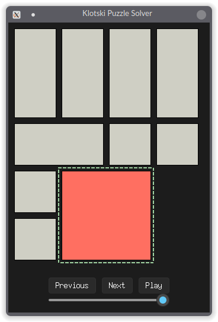

# Puzzle Solver 

For GUI, install tkinter and sv_ttk (`pip install -r requirements.txt`).

Run with `python -m puzzle.main` where `<puzzle>` is the name of the puzzle you want to run.
Disable GUI with `--no-gui`.

### Klotski

The goal of the puzzle is to move the red 2x2 block to the bottom middle of the board. Example solvers using A* and DFS are provided.

The GUI allows for visualizing the solution path by pressing the "Next/Prev" buttons, scrolling the mouse wheel, or using the slider. A "Play/Pause" button is also provided to automatically play the solution path.

Example usage:
```
python -m klotski.main
python -m klotski.main -i "input.txt" -o "output.txt" --algorithm "dfs" --no-gui
```
   


